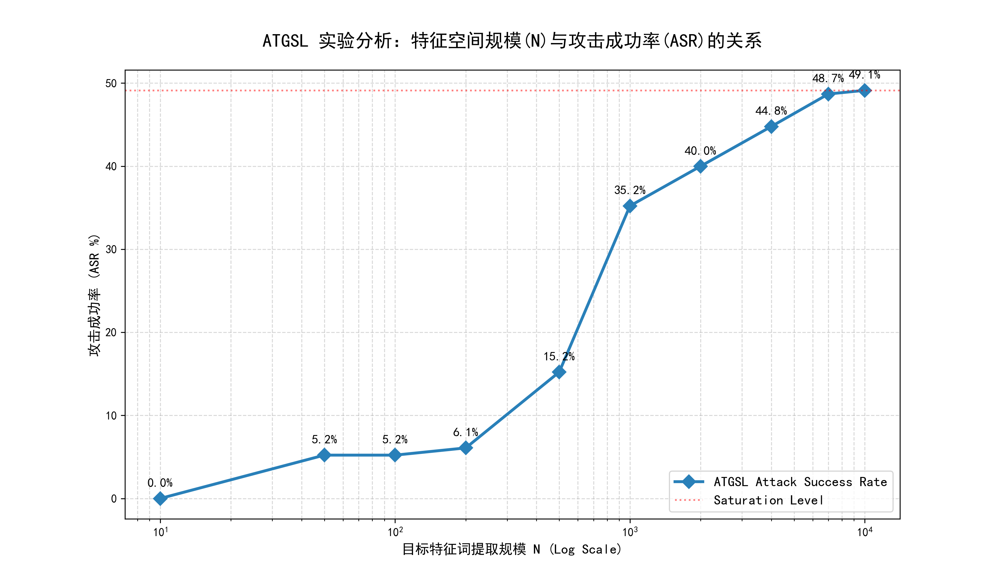

```markdown
基于 ATGSL 的电信诈骗判别模型对抗攻击研究

[]()
[]()
[]()

1. 项目简介
本项目针对基于 TF-IDF + SVM 的电信诈骗话术识别模型开展对抗攻击研究。通过实现 ATGSL (Adversarial Text Generation by Search and Learning) 框架，探测传统统计学习模型在面对语义级扰动时的安全边界。

本实验验证了：即使是一个在原始测试集上准确率高达 99.33% 的模型，在经过科学构建的对抗样本攻击下，其识别效能也会大幅下降。

2. 实验结果汇总 (Results)
实验分为四个递进阶段，展示了攻击强度从手工规则到深度语义搜索的演进过程：

| 实验阶段 | 核心策略描述 | 攻击成功率 (ASR) | 语义保持度 |
| :--- | :--- | :--- | :--- |
| stage 1 | 静态人工词表替换 | 0.07% | 极高 |
| stage 2 | 引入特征删除算子 (Deletion) | 5.98% | 中 |
| Stage 3 | FastText 自动化语义搜索 [7] | 35.22% | 高 (核心突破) |
| Stage 4 | Top-N 特征空间全量学习 | 49.13% | 中 (探测上限) |

3. 核心技术路径
项目实现了“搜索”与“学习”的深度耦合：
* 学习模块 (Learning)：逆向分析权重系数，定位对分类决策贡献最大的核心敏感词。
* 搜索模块 (Search)：利用 FastText 预训练词向量在 300 维语义空间中检索近义词，实现隐蔽改写。
* 回退机制 (Fallback)：当语义库匹配失败时，自动触发“模糊匹配”或“字符注入”策略，确保攻击鲁棒性。



4. 文件结构与说明
```text
.
├── src/                    # 源代码文件夹
│   ├── original_svm_train.py # 基准实验：目标 SVM 模型训练与性能评估
│   ├── stage1_manual.py      # 第一阶段：基于手工词表的启发式测试
│   ├── stage2_deletion.py    # 第二阶段：特征删除算子实验
│   ├── stage3_fasttext.py    # 第三阶段：基于 FastText 的语义攻击实现
│   └── stage4_analysis.py    # 第四阶段：特征规模 N 的敏感度与消融分析
├── data/                   # 数据文件夹
│   ├── fraud_data.csv        # 原始数据集 (示例)
│   └── attack_results.csv    # 攻击生成的对抗样本记录
├── results/                # 实验可视化结果
│   └── asr_trend_plot.png    # ASR 随特征规模增长趋势图
├── requirements.txt        # 环境依赖清单
└── README.md               # 项目说明文档
```

## 5. 环境配置与运行

### 5.1 安装依赖

```bash
pip install -r requirements.txt

```

### 5.2 资源准备 (重要说明)

由于预训练词向量文件体积巨大，本仓库未包含以下权重文件，请开发者自行准备：

1. **模型权重**：确保 `svm_clf.pkl` 与 `vectorizer.pkl` 位于项目根目录。
2. **词向量文件**：下载 FastText 中文预训练向量 `cc.zh.300.vec` (约 4.2GB)。
* [官方下载地址](https://fasttext.cc/docs/en/crawl-vectors.html)
* 请将下载后的 `.vec` 文件放置于代码指定的路径下，否则 Stage 3/4 将无法运行。


### 5.3 运行攻击

```bash
python src/stage4_analysis.py

```

## 6. 参考文献 (References)

[1] Jin D., Jin Z., Zhou J. T., Szolovits P. Is BERT Really Robust? A Strong Baseline for Natural Language Attack on Text Classification and Entailment. arXiv.

[2] Li L., Chen J., Zhang S., Zhao Q. BERT-ATTACK: Adversarial Attack Against BERT Using BERT. EMNLP, 2020.

[3] Garg S., Ramakrishnan G. BAE: BERT-based Adversarial Examples for Text Classification. EMNLP, 2020.

[4] Peng H. et al. TextJuggler: Fooling text classification tasks by generating high-quality adversarial examples. Knowledge-Based Systems, 2024.

[5] Hieu Le, et al. Semi-supervised Adversarial Text Generation based on Seq2Seq models. EMNLP Industry Track, 2022.

[6] Guoyi Li, et al. Adversarial Text Generation by Search and Learning. Findings of EMNLP 2023.

[7] GRAVE E, Bojanowski P, et al. Learning Word Vectors for 157 Languages. LREC 2018.


